# <u>Second Year PBL Project - PanditMitra - Website for booking pandit for an auspacious pooja</u>


## Click on green colored "code" button on top left of folders & click on "download as zip"

## Clone the project onto your local Machine

## Running the application

Enter  your smtp account  email & password in the folder panditMitra > settings.py
```
# email sender settings
EMAIL_BACKEND = 'django.core.mail.backends.smtp.EmailBackend'
EMAIL_HOST = 'smtp.gmail.com'
EMAIL_PORT = 587
EMAIL_USE_TLS = True
EMAIL_HOST_USER = 'email@gmail.com' # enter your email here
EMAIL_HOST_PASSWORD = 'password' # enter your password here
#EMAIL_USE_SSL = False
```  

Run this application by command:

>	python manage.py runserver

make sure you have django(4.0) installed on your device

Screenshots of website - 


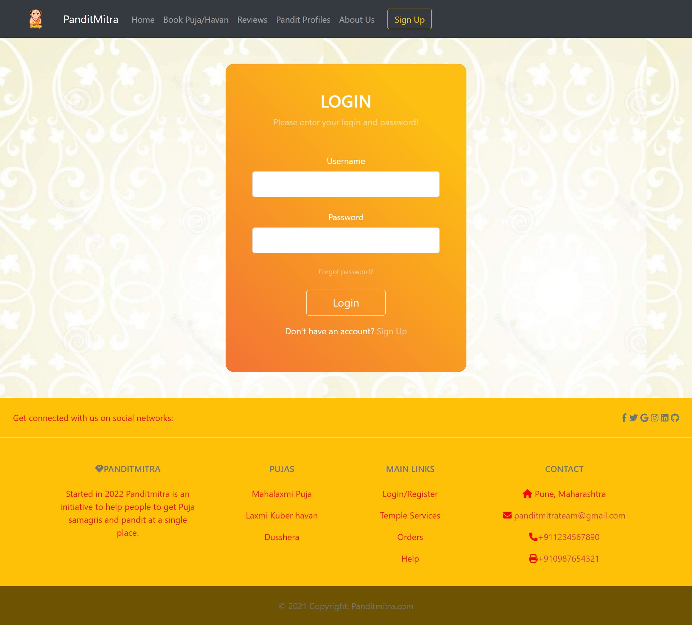

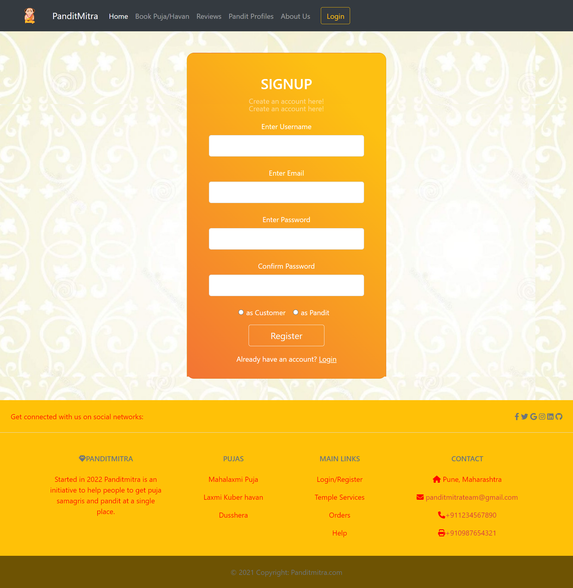


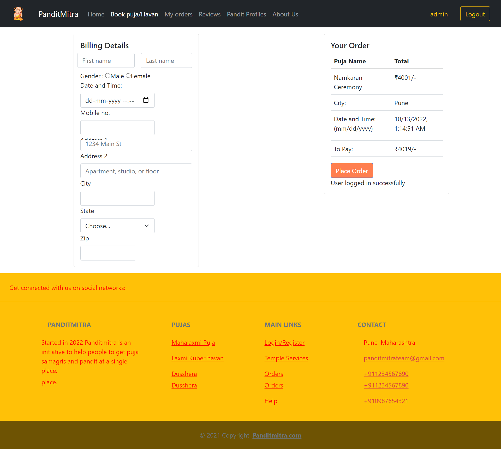

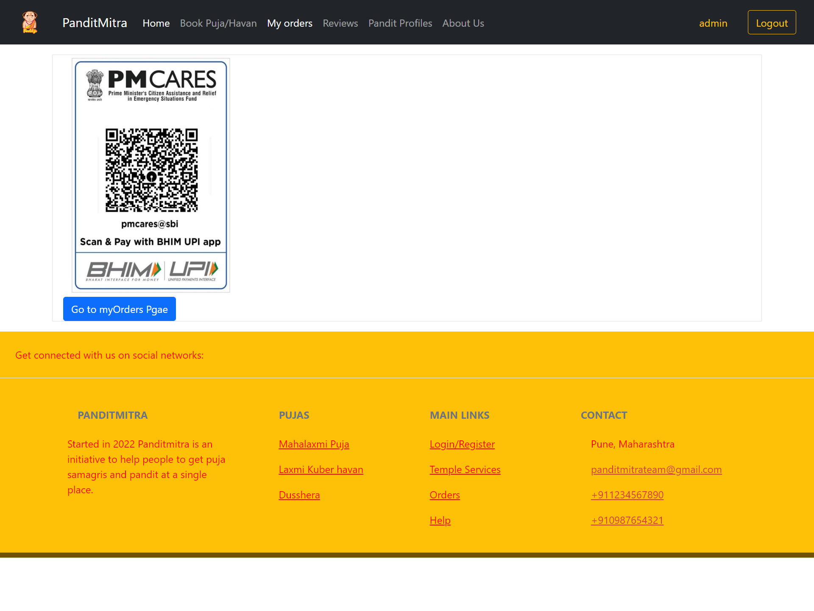

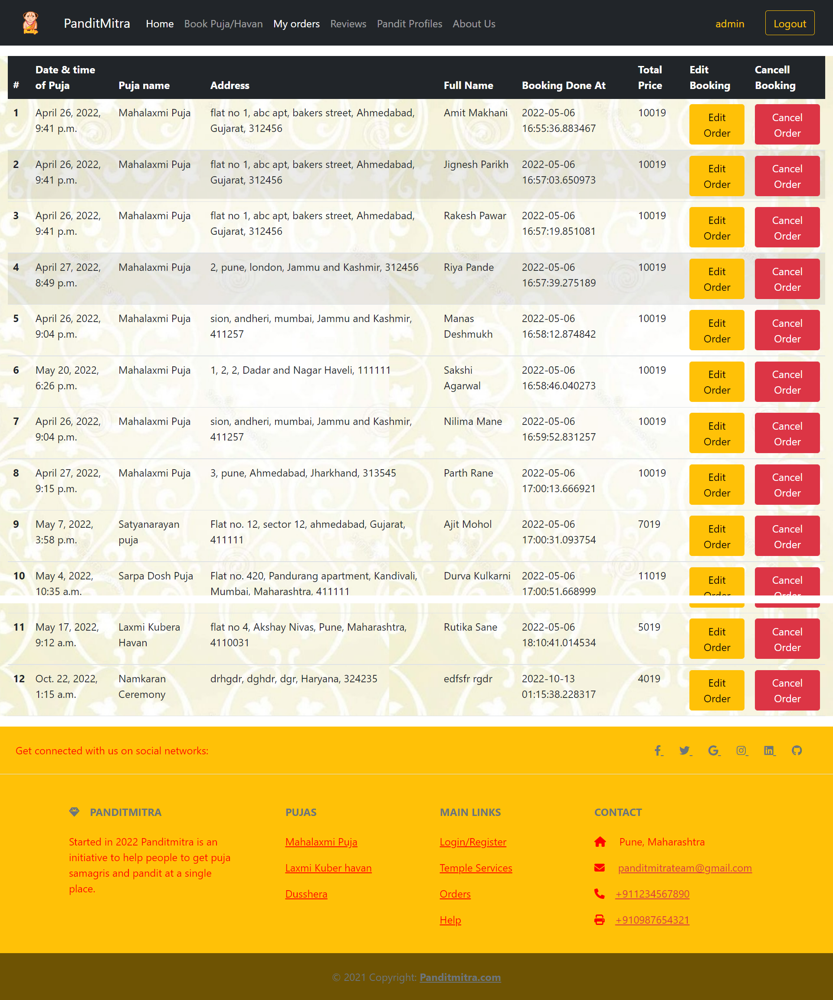


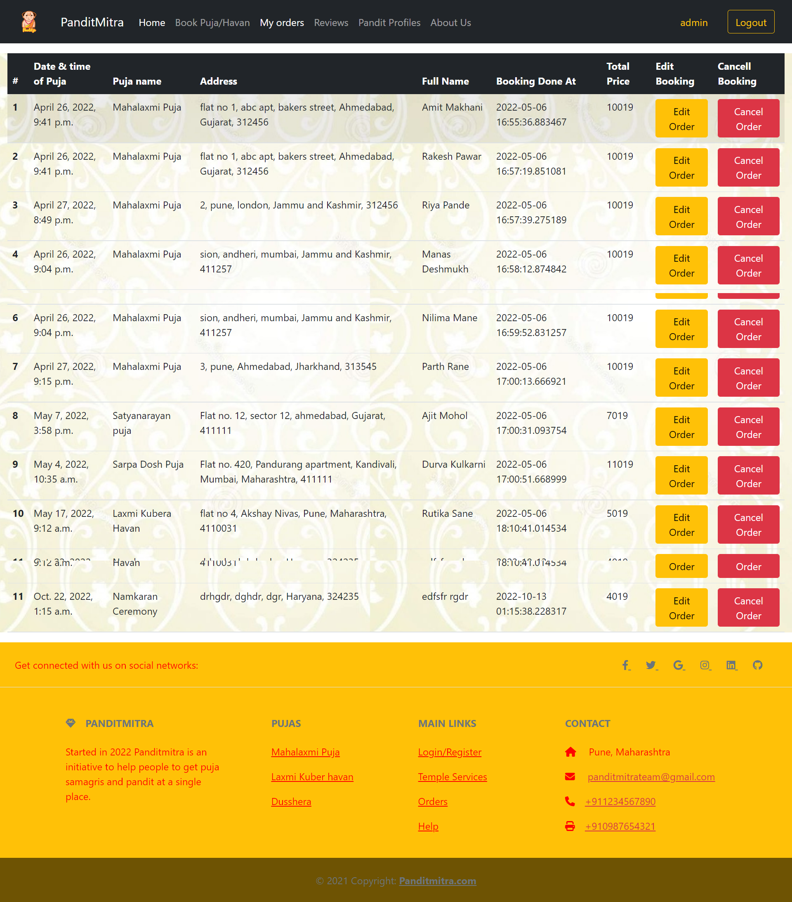

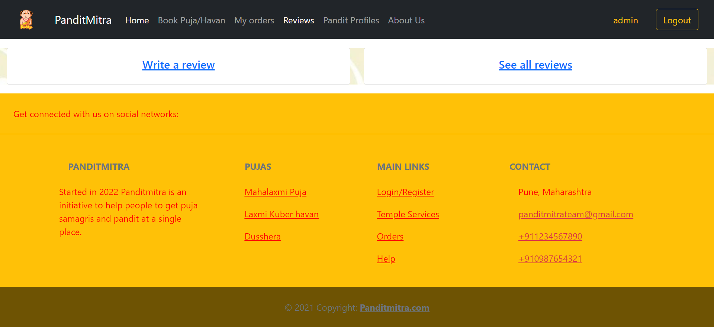

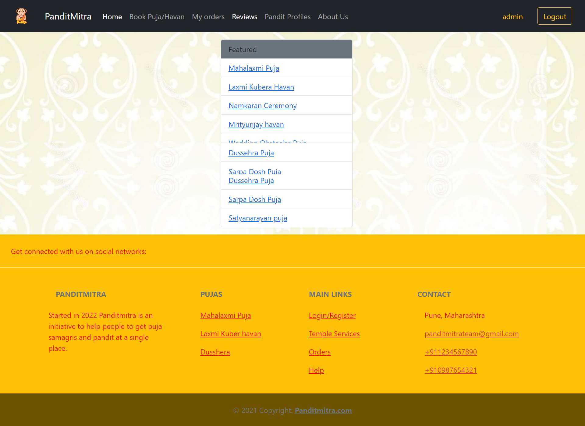

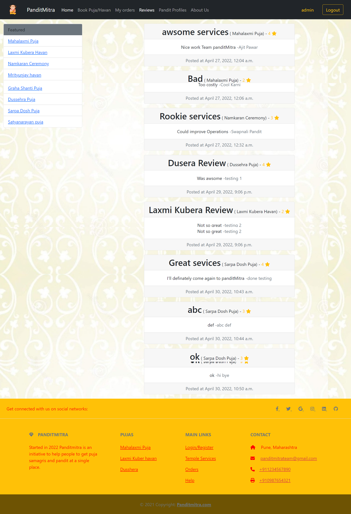

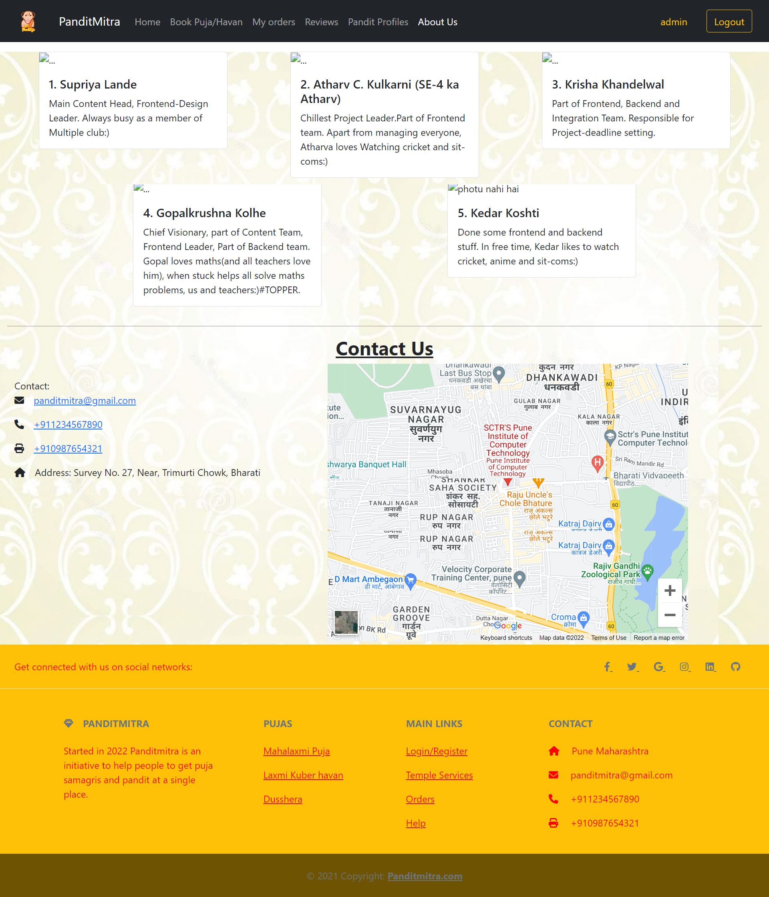


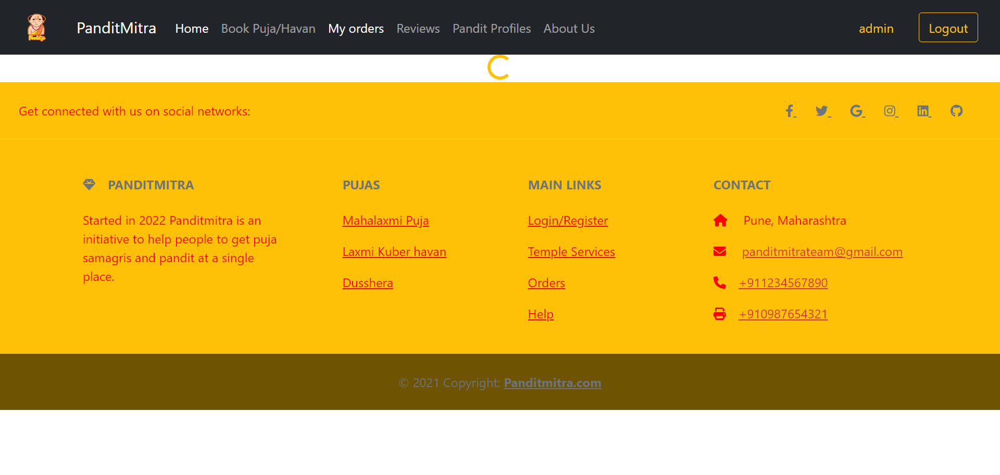
